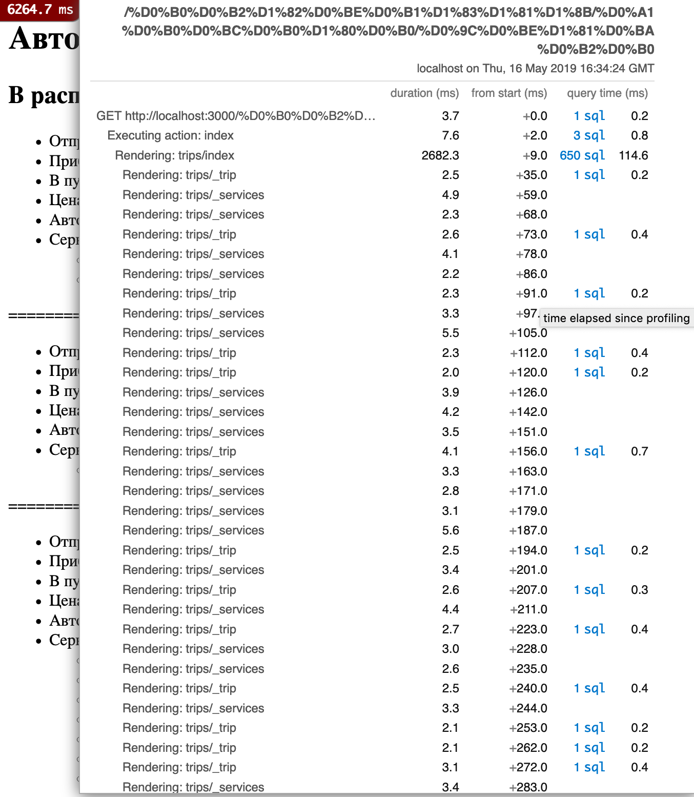
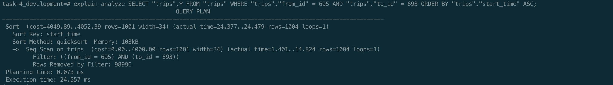
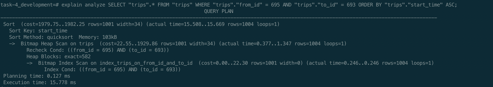
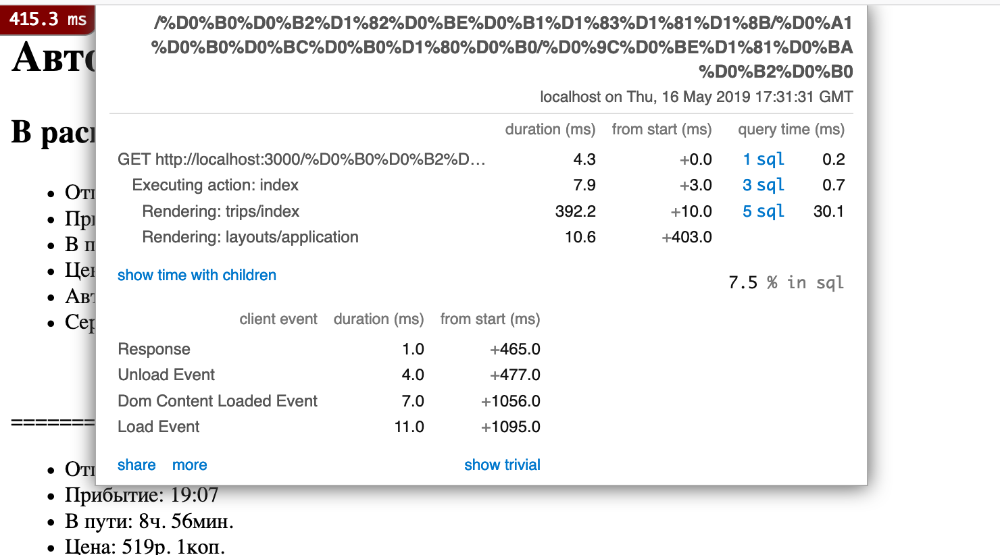
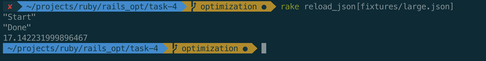

# Case-study оптимизации

## Актуальная проблема
1. Медленная загрузка данных в базу
2. Медленная загрузка страницы с расписанием

## Формирование метрики
Для расчета времени загрузки данных в базу использовался ```Benchmark.realtime```
Для измерения скорости загрузки страницы использовался ```gem rack-mini-profiler```

## Feedback-Loop
В качестве референсного файла использовался fixtures/small.json, по результатам обработки которого уже принималось решение относительно эффективности того или иного метода оптимизации.
Эффективность оптимизаций по скорости загрузки страницы оценивалась на основе метрик ```gem rack-mini-profiler```

### Загрузка данных в базу
## Находка №1
Для обработки каждой json записи инициализируется несколько объектов и каждый из них в отдельной транзакции вставляется в базу данных, что крайне неэффективно на больших объемах. Было принято решение использовать ```gem activerecord-import```, для массовой вставки данных

## Находка №2
Используется устаревший метод ```has_and_belongs_to_many```. Использовав связную модель через ```has many through:```, появляется возможность более эффективно использовать ```gem activerecord import```

## Находка №3
Используется не самая эффективная библиотека для работы с json. Было принято решение использовать ```gem oj```, для более эффективной обработки

### Загрузка стрaницы
Замеры проводились после загрузки файла ```fixtures/large.json```
Исходя из результатов ```gem rack-mini-profiler```  можно сделать следующие выводы:

## Находка №1
Огромное количество запросов к БД и большое количество N+1 запросов. Принято решение использовать includes для подгрузки ассоциаций и ликвидации лишних запросов.

## Находка №2
Большое количество времени занимает отрисовка partial. Было принято решение кешировать результаты

## Находка №3
Проанализировав sql, стало понятно, что не используются индексы на некоторых таблицах


Добавив соответствующие индексы удалось существенно ускорить выполнение запросов



## Результаты



Благодаря оптимизациям удалось снизить скорость загрузки страницы до 420ms и загрузить требуемый файл за 17сек
