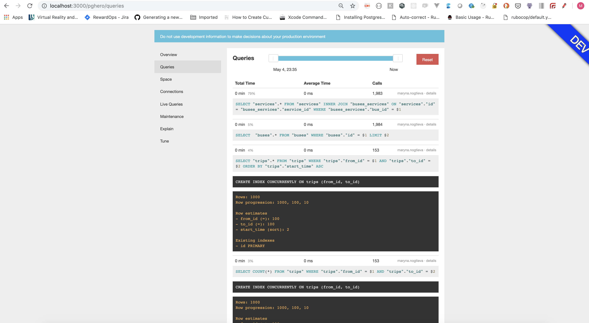
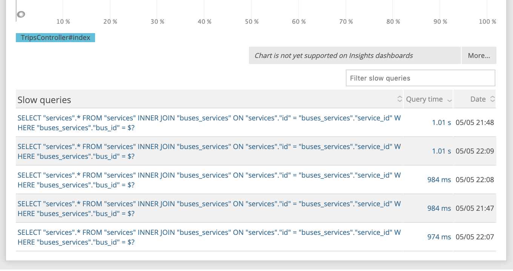
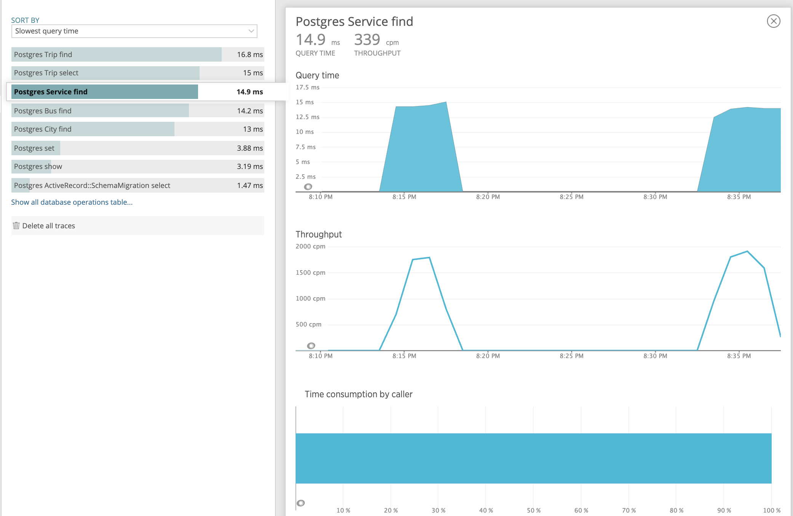
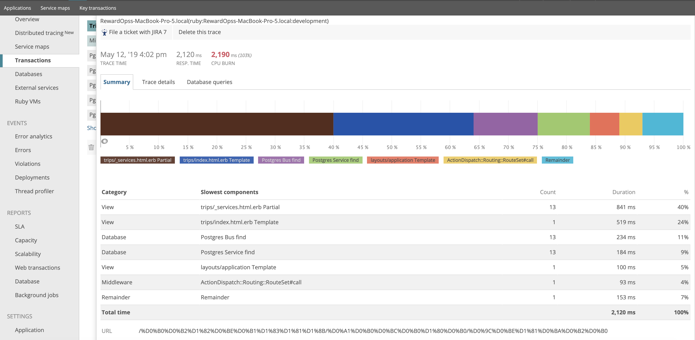

# We had a problem of loading large json files as well as rendering web pages fast with the given amount of data.

## Main goal is:
  - Optimize program to load large.json file within 1(one) minute.
  - Find out how we ca n render schedule pages faster

## Tools I used to solve the problem:
  - gem pghero
  - newrelic
  - gem activerecord-import
  - gem strong_migrations
  - benchmark
  - apache benchmark testing



## For given feedback loop on database level I did the following:
  - desided to start with `small.json` in order to increase feedback loop
  - extracted logic from rake tasks in it's own class so that it's easier to test.
  - wrote test for loadeing `.json` files
  - by implementing any changes on database level I made sure tests are passing and my metrics from new relic and benchmark metrics show better results

## Let\'s look at `Benchmark.measure` numbers showing the following:
- CPU time 
- system CPU time
- the sum of the user and system CPU time
- the elapsed real time. The unit of time is seconds.

#### Initial results of running `be rake 'import_json_benchmark[fixtures/small.json]'`:
```
 2.654352   0.956313  13.612620 (14.781368)
```





#### Results  of running `be rake 'import_json_benchmark[fixtures/small.json]'` after optimization and using `gem oj`, `gem activerecord-import`, adding necessary indicies:
```
1.585816   0.067304   1.655319 (1.651922)
```

#### This improvement allowed me to load `fixtures/large.json` file with the following metrics:
```
 33.660827   0.582401  34.245360 (40.213537)
```


### Page load metrics
### Newrelic

#### Apache benchmark
1. With indicies but without front end optimization

```
ab -n 10 -c 1  http://localhost:3000/автобусы/Самара/Москва


Server Software:
Server Hostname:        localhost
Server Port:            3000

Document Path:          /%D0%B0%D0%B2%D1%82%D0%BE%D0%B1%D1%83%D1%81%D1%8B/%D0%A1%D0%B0%D0%BC%D0%B0%D1%80%D0%B0/%D0%9C%D0%BE%D1%81%D0%BA%D0%B2%D0%B0
Document Length:        538780 bytes

Concurrency Level:      1
Time taken for tests:   247.233 seconds
Complete requests:      10
Failed requests:        0
Total transferred:      5395342 bytes
HTML transferred:       5387800 bytes
Requests per second:    0.04 [#/sec] (mean)
Time per request:       24723.295 [ms] (mean)
Time per request:       24723.295 [ms] (mean, across all concurrent requests)
Transfer rate:          21.31 [Kbytes/sec] received

Connection Times (ms)
              min  mean[+/-sd] median   max
Connect:        0    0   0.0      0       0
Processing: 22301 24723 948.8  25043   25566
Waiting:    22300 24723 948.9  25043   25566
Total:      22301 24723 948.8  25043   25566

Percentage of the requests served within a certain time (ms)
  50%  25043
  66%  25186
  75%  25199
  80%  25265
  90%  25566
  95%  25566
  98%  25566
  99%  25566
 100%  25566 (longest request)
 ````


2. After removing partials and adding collections
```
ab -n 10 -c 1  http://localhost:3000/автобусы/Самара/Москва
Server Software:
Server Hostname:        localhost
Server Port:            3000

Document Path:          /%D0%B0%D0%B2%D1%82%D0%BE%D0%B1%D1%83%D1%81%D1%8B/%D0%A1%D0%B0%D0%BC%D0%B0%D1%80%D0%B0/%D0%9C%D0%BE%D1%81%D0%BA%D0%B2%D0%B0
Document Length:        569667 bytes

Concurrency Level:      1
Time taken for tests:   45.169 seconds
Complete requests:      10
Failed requests:        0
Total transferred:      5704204 bytes
HTML transferred:       5696670 bytes
Requests per second:    0.22 [#/sec] (mean)
Time per request:       4516.931 [ms] (mean)
Time per request:       4516.931 [ms] (mean, across all concurrent requests)
Transfer rate:          123.33 [Kbytes/sec] received

Connection Times (ms)
              min  mean[+/-sd] median   max
Connect:        0    0   0.0      0       0
Processing:  3838 4517 448.1   4523    5575
Waiting:     3838 4516 448.1   4522    5575
Total:       3838 4517 448.1   4523    5575

Percentage of the requests served within a certain time (ms)
  50%   4523
  66%   4573
  75%   4583
  80%   4725
  90%   5575
  95%   5575
  98%   5575
  99%   5575
 100%   5575 (longest request)
 ````

As we can see from the results above after getting rid of partials and rendering partial with collection
- Time taken for tests reduced from 247.233 seconds to  45.169 seconds
- Time per request reducded from 24723.295 [ms] (mean) to 4516.931 [ms] (mean)
- Requests per second increased from 0.04 [#/sec] to 0.22 [#/sec] (mean)

