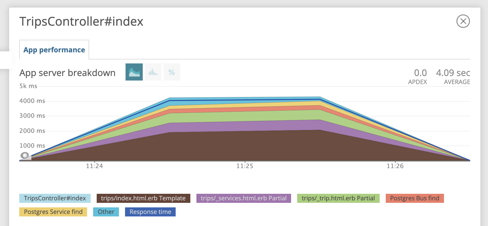

# Case-study оптимизации

## Оптимизация 1
Цель: Необходимо оптимизировать механизм перезагрузки расписания из файла так, чтобы он обрабатывал файл в пределах минуты.

Метрика: Время загрузки файла расписания

Время загрузки файла `large.json` до оптимизации составило почти **9 минут**.
```
Warming up --------------------------------------
               small     1.000  i/100ms
              medium     1.000  i/100ms
               large     1.000  i/100ms
Calculating -------------------------------------
               small      0.123  (± 0.0%) i/s -      1.000  in   8.114570s
              medium      0.020  (± 0.0%) i/s -      1.000  in  50.703538s
               large      0.002  (± 0.0%) i/s -      1.000  in 516.493682s
```

Написан тест проверщий работоспособность сервиса импорта.

Написан `feedback-loop.rb` выполнящий замер производительности.

Для чистоты эксперимента вынес загрузку расписания в отдельный сервис `TripsService`:
 - Создал индексы для таблиц `Bus`, `Service`, `BusesService`
 - Переделал чтение json через `oj`
 - Сделал пакетное добавление данных в БД с `activerecord-import`

В результате:

Удалось уменьшить время загрузки до **15 сек**.

Сократил число запросов к базе с **96** к константным **12**.

```
Warming up --------------------------------------
               small     1.000  i/100ms
              medium     1.000  i/100ms
               large     1.000  i/100ms
Calculating -------------------------------------
               small      3.859  (± 0.0%) i/s -     19.000  in   5.025707s
              medium      0.572  (± 0.0%) i/s -      3.000  in   5.248226s
               large      0.065  (± 0.0%) i/s -      1.000  in  15.374852s

Comparison:
               small:        3.9 i/s
              medium:        0.6 i/s - 6.75x  slower
               large:        0.1 i/s - 59.33x  slower
```

## Оптимизация 2
По графику из new relic видно, что много времени занимает рендеринг паршалов и поиск сервисов и автобусов в БД.



### Оптимизация
- Перенес паршалы в один паршал `_trips`.
- Добавил кеширование к этому паршалу.
- Избавился от `N+1` с помощью `bullet` и написал тест c `n_plus_one_control` добавил предзагрузку автобусов с сервисами.
- Добавил индексы к полям `trips`.

В результате проделанной оптимизации время рендеринга страницы составило **824 ms** для файла `large.json`
```
➜ ab -n 100 -c 10 http://localhost:3000/автобусы/Самара/Москва/
This is ApacheBench, Version 2.3 <$Revision: 1826891 $>
Copyright 1996 Adam Twiss, Zeus Technology Ltd, http://www.zeustech.net/
Licensed to The Apache Software Foundation, http://www.apache.org/

Benchmarking localhost (be patient).....done


Server Software:
Server Hostname:        localhost
Server Port:            3000

Document Path:          /автобусы/Самара/Москва/
Document Length:        71470 bytes

Concurrency Level:      10
Time taken for tests:   8.246 seconds
Complete requests:      100
Failed requests:        0
Non-2xx responses:      100
Total transferred:      7171200 bytes
HTML transferred:       7147000 bytes
Requests per second:    12.13 [#/sec] (mean)
Time per request:       824.596 [ms] (mean)
Time per request:       82.460 [ms] (mean, across all concurrent requests)
Transfer rate:          849.28 [Kbytes/sec] received

Connection Times (ms)
              min  mean[+/-sd] median   max
Connect:        0    0   0.0      0       0
Processing:    91  791 133.8    817    1120
Waiting:       91  790 133.8    815    1111
Total:         91  791 133.8    817    1120

Percentage of the requests served within a certain time (ms)
  50%    817
  66%    834
  75%    844
  80%    856
  90%    892
  95%    912
  98%    962
  99%   1120
 100%   1120 (longest request)
```
